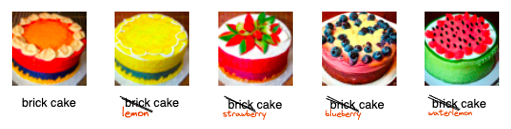

# Hana 

**Hana** is an open-source library that can create realistic images and art from a textual description based on **diffusion models**. It mainly follows [Imagen](https://imagen.research.google/) and [DALLE-2](https://openai.com/dall-e-2/) and is built upon [pytorch-lightning](https://www.pytorchlightning.ai/) framework.

<div align="center">
  
</div>

The main features of **hana** can be summarized as follows:
* 🍀 A simple implementation of text-to-image model based on [Imagen](https://imagen.research.google/) and [DALLE-2](https://openai.com/dall-e-2/). Detailed training scripts are provided.
* 🌸 Pretrained text-to-image model to generate images of resolution 64x64 given textual description.
* 🌺 Pretrained upsampler to upscale 64x64 images to 256x256 resolution.
* 🌼 Support various downstream applications, such as prompt-to-prompt, dreambooth and dreamfusion.


## News
* **`23 Dec, 2022`:** **Hana** code and pretrained weights are released!


## Installation
- Clone this repo
```bash
git clone https://github.com/IDEA-Research/hana.git
cd hana
```

- Create a conda virtual environment and activate it
```bash
conda create -n hana python=3.8 -y
conda activate hana
```

- Install `CUDA==11.1` following the [official installation instructions](https://docs.nvidia.com/cuda/cuda-installation-guide-linux/index.html)
- Install required packages
```bash
pip install -r requirements.txt
```

## Inference
We provide text-to-image 256x256 inference jupyter notebook. Have fun with [inference](inference.ipynb).  
Before running inference, please download our pretrained model weights and corresponding config files following [MODEL](MODEL.md) guidance.

## Downstream applications
* **Prompt-to-prompt**  
  Image editing with cross-attention control. 
  * Our Implementation:
  We recommend taking a look at our notebook: [prompt-to-prompt](prompt2prompt/prompt2prompt.ipynb) to get started. The notebook contains a simple end-to-end example of using prompt-to-prompt on top of our pretrained 64x64 text-to-image model.
  <div align="center">
    
  </div> 

  * For reference: [[paper]](https://prompt-to-prompt.github.io/ptp_files/Prompt-to-Prompt_preprint.pdf) Implemented with stable difusion[[code]](https://github.com/google/prompt-to-prompt) 
* **Dreambooth**  
  "Personalize" text-to-image generative models on user-provided images (concepts).  
  *Code coming soon!*
  * For reference: [[paper]](https://arxiv.org/abs/2208.12242) Implemented with stable diffusion [[code]](https://github.com/XavierXiao/Dreambooth-Stable-Diffusion) 
* **Dreamfusion**  
  Text-to-3D using pretrained 2D diffusion model.  
  *Code coming soon!*
  * For reference: [[paper]](https://arxiv.org/abs/2209.14988)  Implemented with stable diffusion  [[code]](https://github.com/ashawkey/stable-dreamfusion) 


## Dataset
Prepare your **text & img** dataset before training. Our model conditions on pretrained models such as T5-XXL and CLIP, for faster training we pre-process texts or images into corresponding features in an offline manner.  
See [DATA](dataset/README.md) for reference.

## Config System
Please refer to [CONFIG](config/CONFIG.md) for details about experiment configs.

## Training
**Train text-to-image 64x64 resolution model**  
Example shown in [train_base64.sh](scripts/train_base64.sh)
```bash
NODES=1
GPUS_PER_NODE=2
MINI_BATCH_SIZE=16
VAL_BATCH_SIZE=4
MAPPING_FILE='path/to/mapping_file'
CONFIG_PATH='path/to/config_path'

python train_base64.py --mapping_file $MAPPING_FILE --config_path $CONFIG_PATH \
    --train_micro_batch_size_per_gpu $MINI_BATCH_SIZE --val_batch_size $VAL_BATCH_SIZE \
    --gpus $GPUS_PER_NODE --num_nodes $NODES \
    --fp16 --wandb_debug
```
Args:
- `--mapping_file [Required]`: specify dataset index file path.
- `--config_path [Required]`: specify experiment config file path.
- `--train_micro_batch_size_per_gpu:int [Required]`: batch size to be processed by one GPU in one training step (without gradient accumulation).
- `--val_batch_size:int [Required]`: validation batch size.
- `--gpus:int [Required]`: the number of GPUs to be allocated per node.
- `--num_nodes:int [Required]`: the number of nodes to be allocated.
- `--fp16`: whether to use half-precision in training.
- `--wandb_debug`: whether logging to wandb server


**Resume Training**  
Specify resume checkpoint path in experiment config file, like:
```yaml
...
train:
    resume:
        ckpt_path: path/to/resume_checkpoint
...
```
Then, run training script as detailed above in Training.

## Models
We provide our pretrained model weights and config files, please see [MODEL](MODEL.md) for details.

## Acknowledgements
- [GLIDE](https://github.com/openai/glide-text2im)
- [Imagen-pytorch](https://github.com/cene555/Imagen-pytorch)

## Citation
if hana is helpful for your research or you wish to refer the baseline results published here, we'd really appreciate it if you could cite this project:
```
@misc{ideacvr2022detrex,
  author =       {hana contributors},
  title =        {hana},
  howpublished = {\url{https://github.com/IDEA-Research/hana}},
  year =         {2022}
}
```
